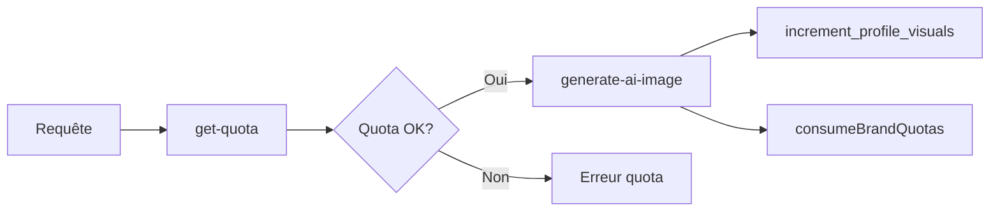
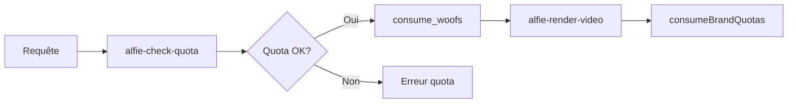

# Système de Quotas - Documentation

## Vue d'ensemble

Le système de quotas gère la consommation des ressources par brand et par utilisateur. Il s'appuie sur trois tables principales :

- **`profiles`** : Quotas et compteurs au niveau utilisateur
- **`brands`** : Quotas et compteurs au niveau marque
- **`counters_monthly`** : Compteurs mensuels détaillés par marque (période YYYYMM)

## Architecture

### Source de Vérité

**Brand** est la source de vérité principale pour les quotas. Le système synchronise automatiquement :

1. Quand un `profile.plan` change → toutes les `brands` de cet utilisateur sont mises à jour
2. Les quotas sont définis dans `plans_config` et appliqués via le trigger `sync_plan_quotas`

### Tables et Colonnes

#### `profiles`
```sql
quota_visuals_per_month INTEGER  -- Quota visuels mensuel
quota_videos INTEGER              -- Quota woofs mensuel  
generations_this_month INTEGER    -- Compteur de visuels générés
woofs_consumed_this_month INTEGER -- Compteur de woofs consommés
plan TEXT                         -- Plan actif (starter/pro/studio)
```

#### `brands`
```sql
quota_images INTEGER              -- Quota visuels mensuel
quota_videos INTEGER              -- Quota vidéos (999 = illimité)
quota_woofs INTEGER               -- Quota woofs mensuel
images_used INTEGER               -- Compteur visuels utilisés
videos_used INTEGER               -- Compteur vidéos utilisées
woofs_used INTEGER                -- Compteur woofs utilisés
plan TEXT                         -- Plan actif (hérité du profile)
resets_on DATE                    -- Date de reset des compteurs
```

#### `counters_monthly`
```sql
brand_id UUID                     -- Référence vers brands
period_yyyymm INTEGER             -- Période (ex: 202511)
images_used INTEGER               -- Images générées ce mois
reels_used INTEGER                -- Reels générés ce mois
woofs_used INTEGER                -- Woofs consommés ce mois
```

## Fonctions Clés

### Consommation de Quotas

#### `consumeBrandQuotas(brandId, addVideos, addWoofs)`
Incrémente les compteurs mensuels dans `counters_monthly`.

**Fichier**: `supabase/functions/_shared/quota.ts`

```typescript
// Exemple d'utilisation
await consumeBrandQuotas(brandId, 0, 15); // +15 woofs
await consumeBrandQuotas(brandId, 1, 0);  // +1 vidéo
```

#### `increment_profile_visuals(profileId, delta)`
Incrémente le compteur de visuels dans `profiles`.

**Fichier**: `supabase/functions/_shared/quotaUtils.ts`

```typescript
await incrementMonthlyVisuals(profileId, 1); // +1 visuel
```

### Vérification de Quotas

#### Edge Function: `get-quota`
Retourne l'état actuel des quotas pour un utilisateur/brand.

**Réponse**:
```json
{
  "ok": true,
  "data": {
    "woofs_quota": 500,
    "woofs_used": 120,
    "woofs_remaining": 380,
    "visuals_quota": 50,
    "visuals_used": 12,
    "visuals_remaining": 38,
    "plan": "pro",
    "reset_date": "2025-12-01T00:00:00Z"
  }
}
```

#### Edge Function: `alfie-check-quota`
Vérifie si un utilisateur a suffisamment de woofs pour une opération.

**Paramètres**:
```json
{
  "cost_woofs": 15,
  "brand_id": "uuid"
}
```

**Réponse**:
```json
{
  "ok": true,
  "remaining": 485,
  "quota_total": 500,
  "new_balance_if_ok": 470
}
```

## Synchronisation Profile ↔ Brand

### Trigger: `sync_brand_plan_with_profile()`
Exécuté automatiquement quand `profiles.plan` change.

**Comportement**:
1. Détecte le changement de plan dans `profiles`
2. Met à jour `brands.plan` pour toutes les marques de l'utilisateur
3. Les quotas sont appliqués via `sync_plan_quotas()`

## Configuration des Plans

### Table: `plans_config`
Définit les limites par plan :

| Plan    | Woofs/Mois | Visuels/Mois | Durées Vidéo | Prix €/Mois |
|---------|------------|--------------|--------------|-------------|
| starter | 100        | 20           | [8,15]       | 19          |
| pro     | 500        | 50           | [8,15,30]    | 49          |
| studio  | 2000       | 200          | [8,15,30,60] | 199         |

## Flux de Génération

### Image AI


### Vidéo AI


## Bonnes Pratiques

### 1. Toujours vérifier AVANT de consommer
```typescript
// ✅ BON
const { ok } = await checkQuota(brandId, cost);
if (ok) {
  await consumeQuota(brandId, cost);
  await performOperation();
}

// ❌ MAUVAIS
await performOperation();
await consumeQuota(brandId, cost); // Trop tard!
```

### 2. Toujours incrémenter les deux systèmes
```typescript
// Pour une image IA
await incrementMonthlyVisuals(profileId, 1);  // profiles
await consumeBrandQuotas(brandId, 0, 0);       // counters_monthly
```

### 3. Gérer les erreurs et remboursements
```typescript
try {
  await consume_woofs(userId, cost);
  const result = await generateVideo();
} catch (error) {
  await refund_woofs(userId, cost); // Rembourser en cas d'échec
  throw error;
}
```

## Debugging

### Vérifier l'état des quotas
```sql
-- État des quotas pour un utilisateur
SELECT 
  p.email,
  p.plan,
  p.quota_visuals_per_month,
  p.generations_this_month,
  p.quota_videos,
  p.woofs_consumed_this_month
FROM profiles p
WHERE p.id = 'user-uuid';

-- État des quotas pour une marque
SELECT 
  b.name,
  b.plan,
  b.quota_images,
  b.images_used,
  b.quota_woofs,
  b.woofs_used,
  b.resets_on
FROM brands b
WHERE b.id = 'brand-uuid';

-- Compteurs mensuels détaillés
SELECT *
FROM counters_monthly
WHERE brand_id = 'brand-uuid'
ORDER BY period_yyyymm DESC;
```

### Logs de génération
```sql
-- Voir les 10 dernières générations
SELECT 
  gl.created_at,
  gl.type,
  gl.status,
  gl.woofs_cost,
  gl.prompt_summary,
  p.email
FROM generation_logs gl
JOIN profiles p ON p.id = gl.user_id
ORDER BY gl.created_at DESC
LIMIT 10;
```

## Reset Mensuel

Les compteurs sont réinitialisés automatiquement :
- `profiles.generations_reset_date` : début du mois suivant
- `brands.resets_on` : début du mois suivant
- `counters_monthly` : nouvelle période YYYYMM créée automatiquement

## Migration & Backfill

Pour synchroniser les données après changement de structure :
```sql
-- Synchroniser plans profile → brands
UPDATE brands b
SET plan = p.plan
FROM profiles p
WHERE b.user_id = p.id 
  AND p.plan IS NOT NULL;

-- Mettre à jour les quotas selon plans_config
UPDATE brands b
SET 
  quota_images = pc.visuals_per_month,
  quota_woofs = pc.woofs_per_month
FROM profiles p
JOIN plans_config pc ON pc.plan = p.plan
WHERE b.user_id = p.id;
```
