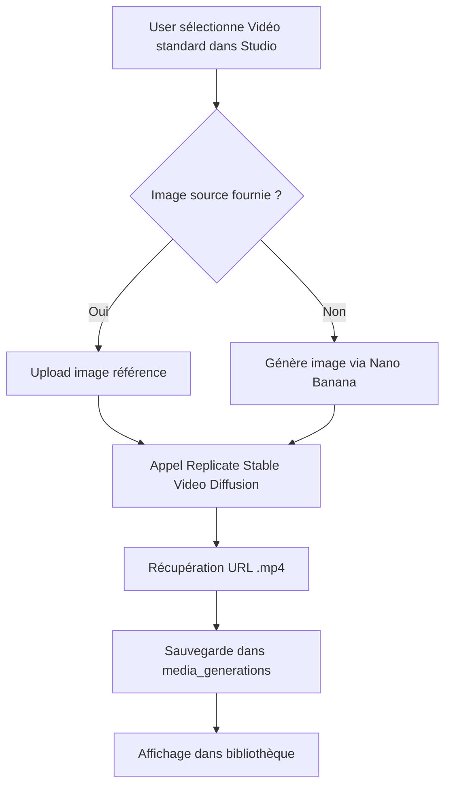
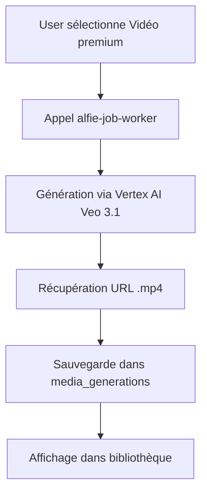

# Pipeline Vidéo Alfie Designer

## Architecture

Alfie Designer utilise deux systèmes de génération vidéo distincts selon le niveau de qualité souhaité :

| Type | Générateur | Input | Durée | Résolution | Coût |
|------|-----------|-------|-------|------------|------|
| **video_basic** | Replicate (Stable Video Diffusion) | Image | 3s | 720x1280 | 10 Woofs |
| **video_premium** | Vertex AI Veo 3.1 | Prompt | 5-15s | 1080p | 50 Woofs |

## Configuration Technique

### Vidéo Standard (Replicate)

**Modèle :** `stability-ai/stable-video-diffusion`

**Paramètres optimisés :**
```typescript
VIDEO_CONFIG = {
  fps: 8,                    // Frames par seconde
  num_frames: 25,            // ~3 secondes à 8fps
  motion_bucket_id: 40,      // Mouvement léger (0-255, plus bas = moins de mouvement)
  noise_aug_strength: 0.02,  // Stabilité visuelle
  width: 720,
  height: 1280,              // Format vertical optimisé
}
```

**Prompt de guidance par défaut :**
```
"subtle, smooth camera movement, professional marketing, no distortions, no glitches"
```

### Vidéo Premium (Veo 3.1)

**Moteur :** Vertex AI Veo 3.1  
**Input :** Prompt texte uniquement  
**Durée :** 5-15 secondes configurables  
**Qualité :** 1080p haute définition

## Flow de Génération

### 1. Vidéo Standard (Image → Video)



**Étapes détaillées :**

1. **Préparation de l'input :**
   - Si `sourceImageUrl` fournie → direct image-to-video
   - Si pas d'image → génération via `alfie-generate-ai-image`

2. **Génération vidéo :**
   ```typescript
   const input = imageUrl 
     ? { image: imageUrl, ...VIDEO_CONFIG }  // Image-to-video
     : { prompt: videoPrompt, ...VIDEO_CONFIG };  // Text-to-video fallback
   ```

3. **Metadata enregistrée :**
   ```json
   {
     "provider": "replicate",
     "tier": "standard",
     "source": "image" | "text",
     "duration": 3,
     "fps": 8,
     "resolution": "720x1280"
   }
   ```

### 2. Vidéo Premium (Veo 3.1)



**Metadata enregistrée :**
```json
{
  "provider": "veo3",
  "tier": "premium",
  "duration": 5-15,
  "resolution": "1080p"
}
```

## Types d'Assets Disponibles

### Dans le Studio Generator

```typescript
Types d'assets disponibles :
├── image (1 Woof)
├── carousel (1 Woof/slide)  
├── video_basic (10 Woofs) → Replicate SVD image-to-video
│   └── 3s, 720x1280, mouvement léger
└── video_premium (50 Woofs) → Veo 3.1
    └── 5-15s, 1080p, haute qualité
```

### Menu d'ajout d'assets

- 🖼️ **Image** - 1 Woof
- 📊 **Carrousel** - 1 Woof par slide
- 🎬 **Vidéo depuis image (3s)** - 10 Woofs
- ✨ **Vidéo premium (Veo 3.1)** - 50 Woofs

## Fichiers Modifiés

### Backend

1. **`supabase/functions/alfie-job-worker/index.ts`**
   - Suppression complète du code Ken Burns Cloudinary (lignes 1074-1169)
   - Routage vidéos standard vers `generate-video` avec provider Replicate
   - Conservation du pipeline Veo 3.1 pour vidéos premium

2. **`supabase/functions/generate-video/index.ts`**
   - Changement de modèle : `minimax/video-01` → `stability-ai/stable-video-diffusion`
   - Ajout de `VIDEO_CONFIG` avec paramètres optimisés (fps: 8, num_frames: 25, motion_bucket_id: 40)
   - Priorisation de l'input image-to-video

### Frontend

3. **`src/pages/StudioGenerator.tsx`**
   - Ajout option "🎬 Vidéo depuis image (3s)" dans le dropdown
   - Durée réduite à 3 secondes par défaut pour vidéos standard

4. **`src/components/studio/PackAssetRow.tsx`**
   - Déjà supporté : upload d'image de référence via `referenceImageUrl`
   - Propagation automatique de `sourceImageUrl` dans le payload

## Nettoyage Effectué

### Suppressions

- ❌ **Ken Burns Cloudinary** : Transformations `e_zoompan`, `animated_base_*.mp4`
- ❌ **Vidéos pseudo-animées** : Génération d'images + overlay CSS
- ❌ **Double génération** : Upload Cloudinary + transformation vidéo

### Conservations

- ✅ **Carrousels Cloudinary** : Images + overlays texte (inchangés)
- ✅ **Vidéos premium Veo 3.1** : Pipeline haute qualité (inchangé)
- ✅ **Images** : Génération via Nano Banana (inchangée)

## Avantages du Nouveau Pipeline

### Performance
- **Temps de génération** : ~30-60 secondes pour vidéos standard (vs 2-3 min Ken Burns)
- **Qualité** : Mouvements naturels et fluides (vs zooms artificiels)
- **Fiabilité** : Moins de 404 et d'URLs cassées

### Coûts
- **Unifié** : 10 Woofs pour toutes les vidéos standard (simple)
- **Prévisible** : Pas de variation selon la durée ou complexité

### UX
- **Simplicité** : Upload image → vidéo en un clic
- **Preview** : Thumbnails fiables depuis l'image source
- **Cohérence** : Toutes les vidéos utilisent le même moteur

## Fonctions Edge Dépréciées

Les fonctions suivantes sont **obsolètes** et retournent `410 Gone` :

| Fonction | Raison | Alternative |
|----------|--------|-------------|
| `chat-generate-video` | Utilisait FFmpeg backend externe | `generate-video` via Studio |
| `alfie-generate-video-slideshow` | Cloudinary slideshow obsolète | `generate-video` avec image source |
| `generate-sora-montage` | Montage multi-clips Sora non maintenu | `generate-video` standard/premium |
| `create-video` | Table `videos` legacy | `generate-video` + `media_generations` |

**Migration :** Toutes les générations vidéo passent désormais par :
- **`generate-video`** (Replicate ou Veo 3.1)
- **Studio UI** (`/studio`)
- **Table `media_generations`** (plus de table `videos` séparée)

**Route frontend `/videos`** redirige automatiquement vers `/studio`.

## Résolution des Problèmes

### URLs Cloudinary cassées

**Problème résolu :**
- Plus de `animated_base_*.mp4` sans domaine
- Plus de transformations `e_zoompan` qui génèrent des 404

**Solution :**
- Toutes les vidéos standard utilisent Replicate
- URLs directes depuis le moteur IA (pas de reconstruction)

### Metadata standardisée

Toutes les vidéos incluent maintenant :
```typescript
metadata: {
  provider: 'replicate' | 'veo3',
  tier: 'standard' | 'premium',
  source: 'image' | 'text',
  duration: number,
  fps?: number,
  resolution: string
}
```

## Prochaines Étapes (Optionnel)

### Améliorations futures possibles

- [ ] Support durées configurables (5s, 8s, 10s) pour vidéos standard
- [ ] Choix du niveau de mouvement (motion_bucket_id) en UI
- [ ] Génération de variantes avec différents mouvements de caméra
- [ ] Preview avant génération (estimation du résultat)
- [ ] Batch generation de vidéos depuis carrousels

---

**Note :** Ce pipeline est opérationnel et stable. Les carrousels continuent de fonctionner exactement comme avant, sans aucun changement.
